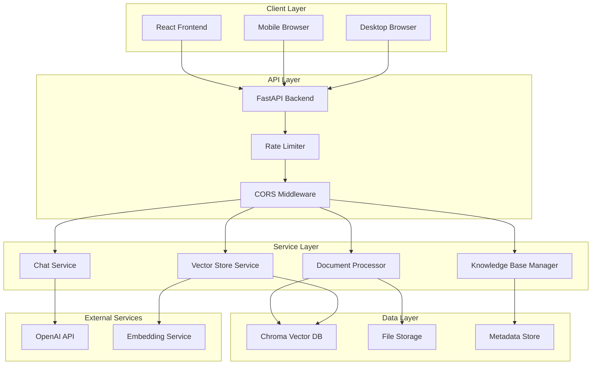
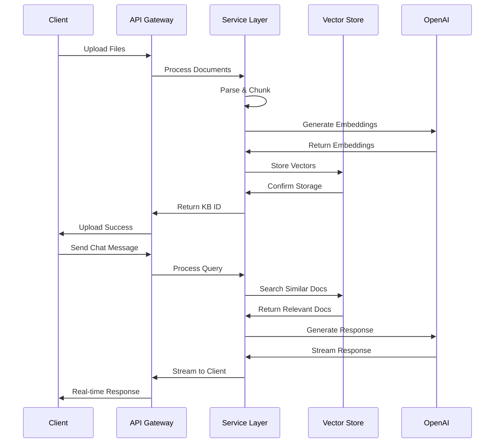
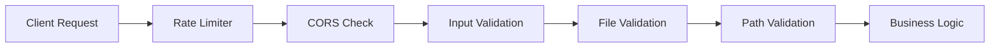
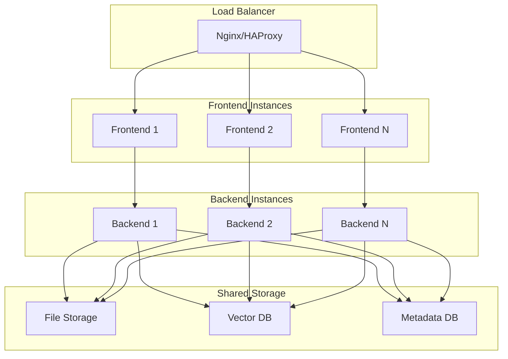

# DocuChat Architecture Documentation

## Overview

DocuChat is a modern full-stack application designed for document-based conversational AI. The architecture follows a microservices pattern with clear separation of concerns between the frontend, backend, and data layers.

## System Architecture

### High-Level Architecture



## Component Details

### Frontend Architecture

#### Technology Stack
- **React 18**: Component-based UI library
- **TypeScript**: Type-safe JavaScript
- **Vite**: Fast build tool and dev server
- **TailwindCSS**: Utility-first CSS framework
- **Framer Motion**: Animation library
- **React Query**: Server state management
- **React Hook Form**: Form handling
- **Zod**: Schema validation

#### Component Hierarchy

```
App
├── Landing Page
│   ├── Hero Section
│   ├── Feature Cards
│   └── CTA Button
└── Dashboard
    ├── Sidebar
    │   ├── Knowledge Base List
    │   ├── KB Actions (CRUD)
    │   └── New KB Button
    ├── Main Content
    │   ├── File Upload Modal
    │   │   ├── FileDropzone
    │   │   ├── Progress Indicator
    │   │   └── File Validation
    │   └── Chat Window
    │       ├── Message List
    │       ├── Message Bubble
    │       ├── Streaming Text
    │       └── Input Form
    └── Settings Panel
        ├── Temperature Slider
        └── Model Selection
```

#### State Management

```typescript
// Global State (React Query)
- Knowledge Bases List
- Current KB Selection
- Chat Messages
- Upload Progress

// Local State (useState)
- UI States (modals, loading)
- Form Data
- Animation States
- Temporary Data
```

#### Data Flow

1. **User Interaction** → Component Event Handler
2. **Event Handler** → API Call (React Query)
3. **API Response** → Cache Update
4. **Cache Update** → Component Re-render
5. **Component Re-render** → UI Update

### Backend Architecture

#### Technology Stack
- **FastAPI**: Modern Python web framework
- **Pydantic**: Data validation and serialization
- **Uvicorn**: ASGI server
- **OpenAI**: LLM and embedding services
- **Chroma**: Vector database
- **SlowAPI**: Rate limiting
- **Python-Jose**: JWT handling

#### Service Layer Design

```python
# Service Architecture
app/
├── api/                    # API Routes
│   ├── upload.py          # File upload endpoints
│   ├── knowledge_base.py  # KB management
│   ├── chat.py           # Chat endpoints
│   └── health.py         # Health checks
├── core/                  # Core functionality
│   ├── config.py         # Configuration
│   └── security.py       # Security utilities
├── models/               # Data models
│   └── schemas.py        # Pydantic schemas
└── services/             # Business logic
    ├── document_processor.py
    ├── vector_store.py
    ├── chat_service.py
    ├── kb_manager.py
    └── workflow.py
```

#### Request Flow



## Data Architecture

### Vector Database Schema

```python
# Chroma Collections
Collection: kb_{knowledge_base_id}
├── Documents: List[Document]
│   ├── id: str (auto-generated)
│   ├── content: str (text chunk)
│   ├── embedding: List[float] (vector)
│   └── metadata: Dict
│       ├── source: str (filename)
│       ├── chunk_index: int
│       ├── total_chunks: int
│       ├── file_type: str
│       └── file_path: str
```

### Metadata Storage

```json
// kb_metadata.json
{
  "kb_id_1": {
    "name": "Knowledge Base Name",
    "created_at": "2024-01-01T00:00:00Z",
    "updated_at": "2024-01-01T00:00:00Z",
    "file_names": ["doc1.pdf", "doc2.docx"],
    "file_count": 2
  }
}
```

### File Storage Structure

```
uploads/
├── kb_id_1/
│   ├── document1.pdf
│   ├── document2.docx
│   └── spreadsheet.csv
└── kb_id_2/
    ├── presentation.pptx
    └── notes.txt
```

## Security Architecture

### Authentication & Authorization



### Security Measures

1. **Input Validation**
   - Pydantic schema validation
   - File type restrictions
   - File size limits
   - Path traversal protection

2. **Rate Limiting**
   - Per-IP rate limiting
   - Endpoint-specific limits
   - Sliding window algorithm

3. **File Security**
   - Filename sanitization
   - Secure file paths
   - Virus scanning (future)
   - Content validation

4. **API Security**
   - CORS configuration
   - Request size limits
   - Timeout handling
   - Error sanitization

## Performance Architecture

### Optimization Strategies

#### Frontend Performance

1. **Code Splitting**
   ```typescript
   // Lazy loading components
   const Dashboard = lazy(() => import('./pages/Dashboard'));
   const Landing = lazy(() => import('./pages/Landing'));
   ```

2. **Caching Strategy**
   ```typescript
   // React Query configuration
   const queryClient = new QueryClient({
     defaultOptions: {
       queries: {
         staleTime: 5 * 60 * 1000, // 5 minutes
         cacheTime: 10 * 60 * 1000, // 10 minutes
       },
     },
   });
   ```

3. **Bundle Optimization**
   - Tree shaking
   - Asset compression
   - CDN delivery
   - Image optimization

#### Backend Performance

1. **Async Processing**
   ```python
   # Async file processing
   async def process_documents(files: List[UploadFile]):
       tasks = [process_file(file) for file in files]
       return await asyncio.gather(*tasks)
   ```

2. **Streaming Responses**
   ```python
   # Server-Sent Events for chat
   async def stream_chat_response():
       async for chunk in chat_service.stream():
           yield f"data: {chunk}\n\n"
   ```

3. **Database Optimization**
   - Vector indexing
   - Batch operations
   - Connection pooling
   - Query optimization

### Scalability Considerations

#### Horizontal Scaling



#### Vertical Scaling

- CPU optimization for document processing
- Memory scaling for vector operations
- Storage scaling for file uploads
- Network optimization for streaming

## Deployment Architecture

### Container Strategy

```dockerfile
# Multi-stage builds for optimization
FROM node:20-alpine as frontend-builder
# Build frontend assets

FROM python:3.11-slim as backend-base
# Install backend dependencies

FROM nginx:alpine as frontend-runtime
# Serve static files

FROM backend-base as backend-runtime
# Run FastAPI application
```

### Orchestration

```yaml
# docker-compose.yml structure
services:
  frontend:
    build: ./frontend
    ports: ["5173:80"]
    depends_on: [backend]
    
  backend:
    build: ./backend
    ports: ["8000:8000"]
    volumes: [uploads, chroma]
    environment: [OPENAI_API_KEY]
    
  nginx:
    image: nginx:alpine
    ports: ["80:80", "443:443"]
    depends_on: [frontend, backend]
```

### Production Deployment

```mermaid
graph TB
    subgraph "CDN"
        CDN[CloudFlare/AWS CloudFront]
    end
    
    subgraph "Load Balancer"
        LB[Application Load Balancer]
    end
    
    subgraph "Container Orchestration"
        K8S[Kubernetes/Docker Swarm]
    end
    
    subgraph "Application Tier"
        APP[DocuChat Containers]
    end
    
    subgraph "Data Tier"
        DB[Vector Database]
        FS[File Storage]
        CACHE[Redis Cache]
    end
    
    subgraph "External Services"
        OPENAI[OpenAI API]
        MONITOR[Monitoring]
    end
    
    CDN --> LB
    LB --> K8S
    K8S --> APP
    APP --> DB
    APP --> FS
    APP --> CACHE
    APP --> OPENAI
    APP --> MONITOR
```

## Monitoring & Observability

### Metrics Collection

1. **Application Metrics**
   - Request/response times
   - Error rates
   - Throughput
   - Resource utilization

2. **Business Metrics**
   - Document upload success rate
   - Chat response quality
   - User engagement
   - Knowledge base usage

3. **Infrastructure Metrics**
   - Container health
   - Database performance
   - Storage usage
   - Network latency

### Logging Strategy

```python
# Structured logging
import structlog

logger = structlog.get_logger()

logger.info(
    "document_processed",
    kb_id=kb_id,
    file_name=file_name,
    chunks_created=len(chunks),
    processing_time=elapsed_time
)
```

### Health Checks

```python
# Comprehensive health checks
@router.get("/health/detailed")
async def detailed_health():
    return {
        "status": "healthy",
        "components": {
            "database": await check_database(),
            "openai": await check_openai_api(),
            "storage": await check_file_storage(),
            "memory": get_memory_usage(),
            "disk": get_disk_usage()
        }
    }
```

## Future Architecture Considerations

### Planned Enhancements

1. **Multi-tenancy Support**
   - User authentication
   - Tenant isolation
   - Resource quotas

2. **Advanced AI Features**
   - Multiple LLM support
   - Custom fine-tuning
   - Conversation memory

3. **Enterprise Features**
   - SSO integration
   - Audit logging
   - Advanced security

4. **Performance Improvements**
   - Caching layers
   - Background processing
   - Real-time collaboration

### Migration Strategies

1. **Database Migration**
   - Version-controlled schemas
   - Zero-downtime deployments
   - Data backup strategies

2. **API Versioning**
   - Backward compatibility
   - Deprecation policies
   - Client migration guides

3. **Infrastructure Evolution**
   - Cloud-native migration
   - Microservices decomposition
   - Event-driven architecture

This architecture provides a solid foundation for DocuChat while maintaining flexibility for future enhancements and scaling requirements.

