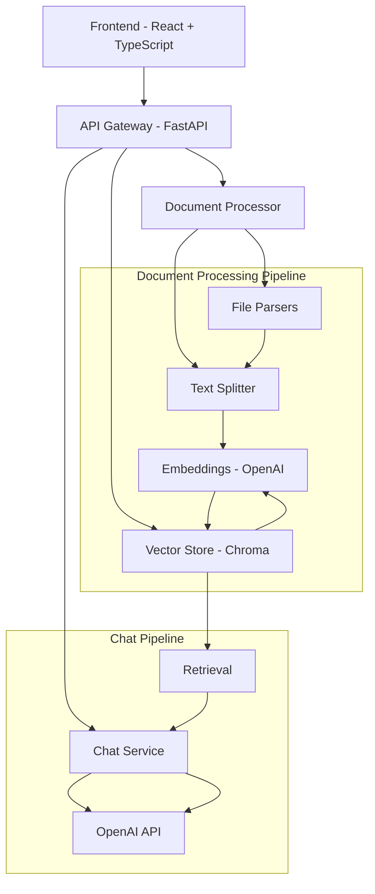

# J-Doc Chat - Chat with Your Documents

DocuChat is a full-stack application that allows users to upload documents and chat with them using AI. Built with FastAPI backend and React frontend, it provides an intelligent document Q&A system powered by vector embeddings and OpenAI.

## ✨ Features

- **Multi-format Support**: Upload PDF, DOCX, TXT, PPTX, and CSV files
- **Intelligent Chat**: Ask questions about your documents in natural language
- **Real-time Streaming**: Get responses as they're generated
- **Knowledge Base Management**: Organize documents into separate knowledge bases
- **Modern UI**: Dark-mode interface with smooth animations
- **Responsive Design**: Works on desktop and mobile devices
- **Rate Limiting**: Built-in API protection
- **Docker Support**: Easy deployment with Docker Compose

## 🏗️ Architecture



## 🚀 Quick Start

### Prerequisites

- Python 3.11+
- Node.js 20+
- OpenAI API Key
- Docker & Docker Compose (optional)

### Environment Setup

1. Clone the repository:
```bash
git clone <repository-url>
cd docuchat
```

2. Copy environment files:
```bash
cp .env.example .env
```

3. Update the `.env` file with your OpenAI API key:
```bash
OPENAI_API_KEY=sk-your-openai-api-key-here
```

### Option 1: Docker Compose (Recommended)

```bash
# Start all services
docker-compose up -d

# View logs
docker-compose logs -f

# Stop services
docker-compose down
```

The application will be available at:
- Frontend: http://localhost:5173
- Backend API: http://localhost:8000
- API Documentation: http://localhost:8000/docs

### Option 2: Manual Setup

#### Backend Setup

```bash
cd backend

# Create virtual environment
python -m venv venv
source venv/bin/activate  # On Windows: venv\Scripts\activate

# Install dependencies
pip install -r requirements.txt

# Start the server
uvicorn app.main:app --host 0.0.0.0 --port 8000 --reload
```

#### Frontend Setup

```bash
cd frontend

# Install dependencies
pnpm install

# Start development server
pnpm run dev --host
```

## 📁 Project Structure

```
docuchat/
├── backend/                 # FastAPI backend
│   ├── app/
│   │   ├── api/            # API routes
│   │   ├── core/           # Configuration & security
│   │   ├── models/         # Pydantic schemas
│   │   └── services/       # Business logic
│   ├── uploads/            # File storage
│   ├── chroma/             # Vector database
│   ├── Dockerfile
│   └── requirements.txt
├── frontend/               # React frontend
│   ├── src/
│   │   ├── components/     # React components
│   │   ├── hooks/          # Custom hooks
│   │   ├── pages/          # Page components
│   │   ├── types/          # TypeScript types
│   │   └── utils/          # Utility functions
│   ├── Dockerfile
│   └── package.json
├── docker-compose.yml      # Docker orchestration
└── README.md
```

## 🔧 Configuration

### Backend Configuration

Environment variables in `backend/.env`:

```bash
# OpenAI Configuration
OPENAI_API_KEY=sk-your-api-key
OPENAI_MODEL=gpt-3.5-turbo
EMBEDDING_MODEL=text-embedding-ada-002

# File Upload
MAX_FILE_SIZE_MB=20
UPLOAD_DIR=./uploads
ALLOWED_EXTENSIONS=[".pdf", ".docx", ".txt", ".pptx", ".csv"]

# Vector Store
CHROMA_PERSIST_DIR=./chroma

# CORS
CORS_ORIGINS=["http://localhost:5173", "http://127.0.0.1:5173"]

# Rate Limiting
RATE_LIMIT_PER_MINUTE=60
```

### Frontend Configuration

Environment variables in `frontend/.env`:

```bash
VITE_API_URL=http://localhost:8000
```

## 📚 API Documentation

The API documentation is automatically generated and available at:
- Swagger UI: http://localhost:8000/docs
- ReDoc: http://localhost:8000/redoc

### Key Endpoints

- `POST /api/v1/upload` - Upload files and create knowledge base
- `GET /api/v1/kb` - List knowledge bases
- `DELETE /api/v1/kb/{kb_id}` - Delete knowledge base
- `POST /api/v1/chat/{kb_id}` - Chat with knowledge base (streaming)
- `GET /api/v1/health` - Health check

## 🎨 Frontend Features

### Components

- **FileDropzone**: Drag-and-drop file upload with validation
- **ChatWindow**: Real-time chat interface with streaming responses
- **MessageBubble**: Animated message components
- **Sidebar**: Knowledge base management
- **Landing**: Animated landing page with typewriter effect

### Animations

- Framer Motion for smooth transitions
- Typewriter effect on landing page
- Message animations with staggered children
- Hover effects and micro-interactions
- Loading skeletons and progress indicators

### Styling

- TailwindCSS for utility-first styling
- Dark mode by default
- Custom CSS animations
- Responsive design
- Glass morphism effects

## 🔒 Security Features

- File type validation
- File size limits
- Path traversal protection
- Rate limiting
- CORS configuration
- Input sanitization

## 🧪 Testing

### Backend Testing

```bash
cd backend
pytest app/tests/
```

### Frontend Testing

```bash
cd frontend
pnpm test
```

## 📦 Deployment

### Production Build

#### Backend

```bash
cd backend
docker build -t docuchat-backend .
```

#### Frontend

```bash
cd frontend
pnpm build
docker build -t docuchat-frontend .
```

### Environment Variables for Production

Update your production environment variables:

```bash
# Backend
OPENAI_API_KEY=your-production-key
CORS_ORIGINS=["https://yourdomain.com"]

# Frontend
VITE_API_URL=https://api.yourdomain.com
```

## 🛠️ Development

### Code Quality

The project includes pre-commit hooks and linting:

```bash
# Backend
cd backend
pre-commit install
black .
ruff check .
mypy .

# Frontend
cd frontend
pnpm lint
pnpm format
```

### Adding New Features

1. **Backend**: Add new routes in `app/api/`, business logic in `app/services/`
2. **Frontend**: Add components in `src/components/`, pages in `src/pages/`
3. **Database**: Extend Chroma collections or add new vector stores
4. **UI**: Use existing design system and animation patterns

## 🐛 Troubleshooting

### Common Issues

1. **OpenAI API Key Error**
   - Ensure your API key is valid and has sufficient credits
   - Check the `.env` file is properly configured

2. **File Upload Fails**
   - Check file size limits (default 20MB)
   - Verify file type is supported
   - Ensure upload directory has write permissions

3. **Chat Not Working**
   - Verify knowledge base exists and has documents
   - Check OpenAI API connectivity
   - Review backend logs for errors

4. **Frontend Build Issues**
   - Clear node_modules and reinstall: `rm -rf node_modules && pnpm install`
   - Check Node.js version compatibility

### Logs

```bash
# Docker logs
docker-compose logs backend
docker-compose logs frontend

# Development logs
# Backend logs appear in terminal
# Frontend logs in browser console
```

## 🤝 Contributing

1. Fork the repository
2. Create a feature branch: `git checkout -b feature/amazing-feature`
3. Commit changes: `git commit -m 'Add amazing feature'`
4. Push to branch: `git push origin feature/amazing-feature`
5. Open a Pull Request

### Development Guidelines

- Follow existing code style and patterns
- Add tests for new features
- Update documentation
- Use conventional commit messages
- Ensure all checks pass

## 📄 License

This project is licensed under the MIT License - see the [LICENSE](LICENSE) file for details.

## 🙏 Acknowledgments

- [FastAPI](https://fastapi.tiangolo.com/) - Modern Python web framework
- [React](https://reactjs.org/) - Frontend library
- [OpenAI](https://openai.com/) - AI models and embeddings
- [Chroma](https://www.trychroma.com/) - Vector database
- [Framer Motion](https://www.framer.com/motion/) - Animation library
- [TailwindCSS](https://tailwindcss.com/) - CSS framework

## 📞 Support

For support, please open an issue on GitHub or contact the development team.

---

**Built with ❤️ by the DocuChat Team**

# J-Docu-Chat

