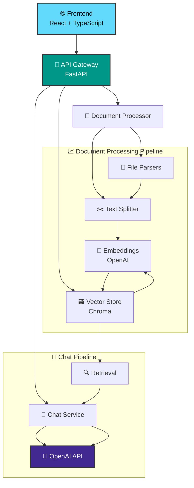

<div align="center">
  <h1>🤖 J-Docu-Chat</h1>
  <p><strong>Intelligent Document Q&A System powered by AI</strong></p>
  
  [](https://github.com/mrjawadhere/J-Docu-Chat/stargazers)
  [](https://github.com/mrjawadhere/J-Docu-Chat/network/members)
  [](https://github.com/mrjawadhere/J-Docu-Chat/blob/main/LICENSE)
  
  
  
  
  
  
</div>

---

## 📖 About

**J-Docu-Chat** is a sophisticated full-stack application that revolutionizes how you interact with your documents. Upload your files and have intelligent conversations with them using cutting-edge AI technology. Built with modern web technologies and powered by OpenAI's advanced language models.

### 🎯 What makes it special?

- 🧠 **AI-Powered Conversations**: Chat naturally with your documents using state-of-the-art language models
- 📄 **Multi-Format Support**: Works with PDF, DOCX, TXT, PPTX, and CSV files
- ⚡ **Real-time Streaming**: Get responses as they're generated for immediate feedback
- 🗂️ **Smart Organization**: Manage multiple knowledge bases for different document collections
- 🎨 **Modern Interface**: Beautiful, responsive design with dark mode support
- 🔒 **Secure & Reliable**: Built-in rate limiting and security features

## ✨ Key Features

<table>
  <tr>
    <td>📁 <strong>Multi-Format Support</strong></td>
    <td>Upload and process PDF, DOCX, TXT, PPTX, and CSV files</td>
  </tr>
  <tr>
    <td>💬 <strong>Intelligent Chat</strong></td>
    <td>Ask questions about your documents in natural language</td>
  </tr>
  <tr>
    <td>⚡ <strong>Real-time Streaming</strong></td>
    <td>Get responses as they're generated with live updates</td>
  </tr>
  <tr>
    <td>🗄️ <strong>Knowledge Base Management</strong></td>
    <td>Organize documents into separate, searchable knowledge bases</td>
  </tr>
  <tr>
    <td>🎨 <strong>Modern UI/UX</strong></td>
    <td>Dark-mode interface with smooth animations and transitions</td>
  </tr>
  <tr>
    <td>📱 <strong>Responsive Design</strong></td>
    <td>Optimized for desktop, tablet, and mobile devices</td>
  </tr>
  <tr>
    <td>🛡️ <strong>Rate Limiting</strong></td>
    <td>Built-in API protection and security measures</td>
  </tr>
  <tr>
    <td>🐳 <strong>Docker Support</strong></td>
    <td>Easy deployment with Docker Compose</td>
  </tr>
</table>

## 🏗️ Architecture



## 🚀 Quick Start

### 📋 Prerequisites

Before you begin, ensure you have the following installed:

- 🐍 **Python 3.11+** - [Download](https://www.python.org/downloads/)
- 🟢 **Node.js 20+** - [Download](https://nodejs.org/)
- 🔑 **OpenAI API Key** - [Get yours](https://platform.openai.com/api-keys)
- 🐳 **Docker & Docker Compose** (optional) - [Install](https://docs.docker.com/get-docker/)

### 🔧 Environment Setup

1. **Clone the repository:**
```bash
git clone https://github.com/mrjawadhere/J-Docu-Chat.git
cd J-Docu-Chat
```

2. **Copy environment files:**
```bash
cp .env.example .env
```

3. **Update the `.env` file with your OpenAI API key:**
```bash
OPENAI_API_KEY=sk-your-openai-api-key-here
CHROMA_PERSIST_DIR=./chroma
MAX_FILE_SIZE_MB=20
CORS_ORIGINS=["http://localhost:5173", "http://127.0.0.1:5173"]
VITE_API_URL=http://localhost:8000
```

### 🐳 Option 1: Docker Compose (Recommended)

Get up and running in minutes with Docker:

```bash
# Start all services
docker-compose up -d

# View logs
docker-compose logs -f

# Stop services
docker-compose down
```

**Access the application:**
- 🌐 **Frontend**: http://localhost:5173
- 🚀 **Backend API**: http://localhost:8000
- 📚 **API Documentation**: http://localhost:8000/docs

### ⚙️ Option 2: Manual Setup

#### Backend Setup

```bash
cd backend

# Create virtual environment
python -m venv venv
source venv/bin/activate  # On Windows: venv\Scripts\activate

# Install dependencies
pip install -r requirements.txt

# Start the server
uvicorn app.main:app --host 0.0.0.0 --port 8000 --reload
```

#### Frontend Setup

```bash
cd frontend

# Install dependencies
pnpm install

# Start development server
pnpm run dev --host
```

## 📁 Project Structure

```
J-Docu-Chat/
├── 📂 backend/                 # FastAPI backend application
│   ├── 📂 app/
│   │   ├── 📂 api/            # API route handlers
│   │   ├── 📂 core/           # Configuration & security
│   │   ├── 📂 models/         # Pydantic schemas
│   │   └── 📂 services/       # Business logic services
│   ├── 📂 uploads/            # Document storage
│   ├── 📂 chroma/             # Vector database storage
│   ├── 🐳 Dockerfile
│   └── 📄 requirements.txt
├── 📂 frontend/               # React frontend application
│   ├── 📂 src/
│   │   ├── 📂 components/     # Reusable React components
│   │   ├── 📂 hooks/          # Custom React hooks
│   │   ├── 📂 pages/          # Page components
│   │   ├── 📂 types/          # TypeScript type definitions
│   │   └── 📂 utils/          # Utility functions
│   ├── 🐳 Dockerfile
│   └── 📦 package.json
├── 🐳 docker-compose.yml      # Docker orchestration
├── 📄 README.md
└── 📄 .env.example
```

## 🔧 Configuration

### Backend Configuration

Create `backend/.env` with the following variables:

```bash
# 🤖 OpenAI Configuration
OPENAI_API_KEY=sk-your-api-key-here
OPENAI_MODEL=gpt-3.5-turbo
EMBEDDING_MODEL=text-embedding-ada-002

# 📁 File Upload Settings
MAX_FILE_SIZE_MB=20
UPLOAD_DIR=./uploads
ALLOWED_EXTENSIONS=[".pdf", ".docx", ".txt", ".pptx", ".csv"]

# 🗃️ Vector Store Configuration
CHROMA_PERSIST_DIR=./chroma

# 🌐 CORS Settings
CORS_ORIGINS=["http://localhost:5173", "http://127.0.0.1:5173"]

# 🛡️ Rate Limiting
RATE_LIMIT_PER_MINUTE=60
```

### Frontend Configuration

Create `frontend/.env` with:

```bash
# 🚀 API Configuration
VITE_API_URL=http://localhost:8000
```

## 📚 API Reference

The API documentation is automatically generated and available at:
- 📖 **Swagger UI**: http://localhost:8000/docs
- 📘 **ReDoc**: http://localhost:8000/redoc

### 🔗 Key Endpoints

| Method | Endpoint | Description |
|--------|----------|-------------|
| `POST` | `/api/v1/upload` | Upload files and create knowledge base |
| `GET` | `/api/v1/kb` | List all knowledge bases |
| `DELETE` | `/api/v1/kb/{kb_id}` | Delete a knowledge base |
| `POST` | `/api/v1/chat/{kb_id}` | Chat with knowledge base (streaming) |
| `GET` | `/api/v1/health` | Health check endpoint |

## 🎨 Frontend Features

### 🧩 Core Components

- **FileDropzone**: Intuitive drag-and-drop file upload with real-time validation
- **ChatWindow**: Responsive chat interface with streaming message support
- **MessageBubble**: Animated message components with typing indicators
- **Sidebar**: Knowledge base management and navigation
- **Landing**: Beautiful animated landing page with typewriter effects

### ✨ Animations & Effects

- 🎭 **Framer Motion** for smooth page transitions
- ⌨️ **Typewriter effect** on the landing page
- 💬 **Message animations** with staggered reveals
- 🎯 **Hover effects** and micro-interactions
- 💀 **Loading skeletons** and progress indicators

### 🎨 Styling & Design

- 🎨 **TailwindCSS** for utility-first styling
- 🌙 **Dark mode** optimized interface
- ✨ **Glass morphism** effects
- 📱 **Fully responsive** design
- 🎪 **Custom animations** and transitions

## 🔒 Security & Protection

- ✅ **File type validation** and sanitization
- 📏 **File size limits** enforcement
- 🛡️ **Path traversal protection**
- ⏱️ **Rate limiting** implementation
- 🌐 **CORS configuration**
- 🧹 **Input sanitization**

## 🧪 Testing

### Backend Testing

```bash
cd backend

# Run all tests
pytest

# Run with coverage
pytest --cov=app tests/

# Run specific test file
pytest tests/test_chat_service.py -v
```

### Frontend Testing

```bash
cd frontend

# Run tests
pnpm test

# Run tests in watch mode
pnpm test:watch

# Generate coverage report
pnpm test:coverage
```

## 🚀 Deployment

### 🏗️ Production Build

#### Backend Docker Build

```bash
cd backend
docker build -t j-docu-chat-backend:latest .
```

#### Frontend Docker Build

```bash
cd frontend
docker build -t j-docu-chat-frontend:latest .
```

### 🌍 Production Environment Variables

**Backend Production (.env):**
```bash
OPENAI_API_KEY=your-production-api-key
CORS_ORIGINS=["https://yourdomain.com"]
MAX_FILE_SIZE_MB=50
RATE_LIMIT_PER_MINUTE=30
```

**Frontend Production (.env):**
```bash
VITE_API_URL=https://api.yourdomain.com
```

### 📋 Deployment Checklist

- [ ] Update API keys for production
- [ ] Configure CORS origins
- [ ] Set up SSL certificates
- [ ] Configure reverse proxy (Nginx)
- [ ] Set up monitoring and logging
- [ ] Configure backup strategy
- [ ] Test all endpoints

## 🛠️ Development

### 📝 Code Quality Tools

```bash
# Backend code quality
cd backend
pre-commit install      # Install pre-commit hooks
black .                 # Format code
ruff check .           # Lint code
mypy .                 # Type checking

# Frontend code quality
cd frontend
pnpm lint              # ESLint
pnpm format            # Prettier
pnpm type-check        # TypeScript checking
```

### 🎯 Adding New Features

1. **Backend Features**:
   - Add routes in `app/api/`
   - Implement business logic in `app/services/`
   - Define schemas in `app/models/`

2. **Frontend Features**:
   - Create components in `src/components/`
   - Add pages in `src/pages/`
   - Implement hooks in `src/hooks/`

3. **Database Extensions**:
   - Extend Chroma collections
   - Add new vector store integrations

## 🐛 Troubleshooting

### 🔧 Common Issues & Solutions

<details>
<summary><strong>🔑 OpenAI API Key Error</strong></summary>

- ✅ Verify your API key is valid and active
- ✅ Check you have sufficient credits
- ✅ Ensure `.env` file is properly configured
- ✅ Restart the backend server after changes
</details>

<details>
<summary><strong>📁 File Upload Fails</strong></summary>

- ✅ Check file size (default limit: 20MB)
- ✅ Verify file type is supported (.pdf, .docx, .txt, .pptx, .csv)
- ✅ Ensure upload directory has write permissions
- ✅ Check disk space availability
</details>

<details>
<summary><strong>💬 Chat Not Working</strong></summary>

- ✅ Verify knowledge base exists and contains documents
- ✅ Check OpenAI API connectivity
- ✅ Review backend logs for errors
- ✅ Ensure vector embeddings were created successfully
</details>

<details>
<summary><strong>🏗️ Frontend Build Issues</strong></summary>

- ✅ Clear cache: `rm -rf node_modules pnpm-lock.yaml && pnpm install`
- ✅ Check Node.js version compatibility (20+)
- ✅ Verify environment variables are set
- ✅ Check for TypeScript errors
</details>

### 📊 Debugging & Logs

```bash
# View Docker logs
docker-compose logs -f backend
docker-compose logs -f frontend

# Check individual container logs
docker logs j-docu-chat-backend
docker logs j-docu-chat-frontend

# Monitor resource usage
docker stats
```

## 🤝 Contributing

We welcome contributions! Here's how to get started:

### 🚀 Quick Contribution Guide

1. **Fork** the repository
2. **Clone** your fork: `git clone https://github.com/yourusername/J-Docu-Chat.git`
3. **Create** a feature branch: `git checkout -b feature/amazing-feature`
4. **Make** your changes and test thoroughly
5. **Commit** with conventional messages: `git commit -m 'feat: add amazing feature'`
6. **Push** to your branch: `git push origin feature/amazing-feature`
7. **Open** a Pull Request

### 📋 Development Guidelines

- 🎯 Follow existing code style and patterns
- ✅ Add tests for new features
- 📚 Update documentation as needed
- 💬 Use conventional commit messages
- 🔍 Ensure all CI checks pass
- 🧪 Test on multiple browsers/devices

### 🏷️ Commit Convention

```
feat: add new feature
fix: bug fix
docs: documentation changes
style: formatting changes
refactor: code refactoring
test: adding tests
chore: maintenance tasks
```

## 🤝 Community & Support

- 🐛 **Issues**: [GitHub Issues](https://github.com/mrjawadhere/J-Docu-Chat/issues)
- 💬 **Discussions**: [GitHub Discussions](https://github.com/mrjawadhere/J-Docu-Chat/discussions)
- 📧 **Email**: support@j-docu-chat.com
- 📚 **Documentation**: [Full Documentation](https://docs.j-docu-chat.com)

## 📄 License

This project is licensed under the **MIT License** - see the [LICENSE](LICENSE) file for details.

## 🙏 Acknowledgments

Special thanks to the amazing open-source projects that make this possible:

- 🚀 [**FastAPI**](https://fastapi.tiangolo.com/) - Modern Python web framework
- ⚛️ [**React**](https://reactjs.org/) - Frontend library
- 🤖 [**OpenAI**](https://openai.com/) - AI models and embeddings
- 🗃️ [**Chroma**](https://www.trychroma.com/) - Vector database
- 🎭 [**Framer Motion**](https://www.framer.com/motion/) - Animation library
- 🎨 [**TailwindCSS**](https://tailwindcss.com/) - CSS framework
- 🧩 [**shadcn/ui**](https://ui.shadcn.com/) - UI components
- 🐳 [**Docker**](https://docker.com/) - Containerization

## ⭐ Star History

[](https://star-history.com/#mrjawadhere/J-Docu-Chat&Date)

---

<div align="center">
  <p><strong>Built with ❤️ by <a href="https://github.com/mrjawadhere">@mrjawadhere</a></strong></p>
  <p>If you found this project helpful, please consider giving it a ⭐!</p>
  
  [](https://github.com/mrjawadhere/J-Docu-Chat/stargazers)
  [](https://github.com/mrjawadhere/J-Docu-Chat/network/members)
</div>

## 📁 Project Structure

```
docuchat/
├── backend/                 # FastAPI backend
│   ├── app/
│   │   ├── api/            # API routes
│   │   ├── core/           # Configuration & security
│   │   ├── models/         # Pydantic schemas
│   │   └── services/       # Business logic
│   ├── uploads/            # File storage
│   ├── chroma/             # Vector database
│   ├── Dockerfile
│   └── requirements.txt
├── frontend/               # React frontend
│   ├── src/
│   │   ├── components/     # React components
│   │   ├── hooks/          # Custom hooks
│   │   ├── pages/          # Page components
│   │   ├── types/          # TypeScript types
│   │   └── utils/          # Utility functions
│   ├── Dockerfile
│   └── package.json
├── docker-compose.yml      # Docker orchestration
└── README.md
```

## 🔧 Configuration

### Backend Configuration

Environment variables in `backend/.env`:

```bash
# OpenAI Configuration
OPENAI_API_KEY=sk-your-api-key
OPENAI_MODEL=gpt-3.5-turbo
EMBEDDING_MODEL=text-embedding-ada-002

# File Upload
MAX_FILE_SIZE_MB=20
UPLOAD_DIR=./uploads
ALLOWED_EXTENSIONS=[".pdf", ".docx", ".txt", ".pptx", ".csv"]

# Vector Store
CHROMA_PERSIST_DIR=./chroma

# CORS
CORS_ORIGINS=["http://localhost:5173", "http://127.0.0.1:5173"]

# Rate Limiting
RATE_LIMIT_PER_MINUTE=60
```

### Frontend Configuration

Environment variables in `frontend/.env`:

```bash
VITE_API_URL=http://localhost:8000
```

## 📚 API Documentation

The API documentation is automatically generated and available at:
- Swagger UI: http://localhost:8000/docs
- ReDoc: http://localhost:8000/redoc

### Key Endpoints

- `POST /api/v1/upload` - Upload files and create knowledge base
- `GET /api/v1/kb` - List knowledge bases
- `DELETE /api/v1/kb/{kb_id}` - Delete knowledge base
- `POST /api/v1/chat/{kb_id}` - Chat with knowledge base (streaming)
- `GET /api/v1/health` - Health check

## 🎨 Frontend Features

### Components

- **FileDropzone**: Drag-and-drop file upload with validation
- **ChatWindow**: Real-time chat interface with streaming responses
- **MessageBubble**: Animated message components
- **Sidebar**: Knowledge base management
- **Landing**: Animated landing page with typewriter effect

### Animations

- Framer Motion for smooth transitions
- Typewriter effect on landing page
- Message animations with staggered children
- Hover effects and micro-interactions
- Loading skeletons and progress indicators

### Styling

- TailwindCSS for utility-first styling
- Dark mode by default
- Custom CSS animations
- Responsive design
- Glass morphism effects

## 🔒 Security Features

- File type validation
- File size limits
- Path traversal protection
- Rate limiting
- CORS configuration
- Input sanitization

## 🧪 Testing

### Backend Testing

```bash
cd backend
pytest app/tests/
```

### Frontend Testing

```bash
cd frontend
pnpm test
```

## 📦 Deployment

### Production Build

#### Backend

```bash
cd backend
docker build -t docuchat-backend .
```

#### Frontend

```bash
cd frontend
pnpm build
docker build -t docuchat-frontend .
```

### Environment Variables for Production

Update your production environment variables:

```bash
# Backend
OPENAI_API_KEY=your-production-key
CORS_ORIGINS=["https://yourdomain.com"]

# Frontend
VITE_API_URL=https://api.yourdomain.com
```

## 🛠️ Development

### Code Quality

The project includes pre-commit hooks and linting:

```bash
# Backend
cd backend
pre-commit install
black .
ruff check .
mypy .

# Frontend
cd frontend
pnpm lint
pnpm format
```

### Adding New Features

1. **Backend**: Add new routes in `app/api/`, business logic in `app/services/`
2. **Frontend**: Add components in `src/components/`, pages in `src/pages/`
3. **Database**: Extend Chroma collections or add new vector stores
4. **UI**: Use existing design system and animation patterns

## 🐛 Troubleshooting

### Common Issues

1. **OpenAI API Key Error**
   - Ensure your API key is valid and has sufficient credits
   - Check the `.env` file is properly configured

2. **File Upload Fails**
   - Check file size limits (default 20MB)
   - Verify file type is supported
   - Ensure upload directory has write permissions

3. **Chat Not Working**
   - Verify knowledge base exists and has documents
   - Check OpenAI API connectivity
   - Review backend logs for errors

4. **Frontend Build Issues**
   - Clear node_modules and reinstall: `rm -rf node_modules && pnpm install`
   - Check Node.js version compatibility

### Logs

```bash
# Docker logs
docker-compose logs backend
docker-compose logs frontend

# Development logs
# Backend logs appear in terminal
# Frontend logs in browser console
```

## 🤝 Contributing

1. Fork the repository
2. Create a feature branch: `git checkout -b feature/amazing-feature`
3. Commit changes: `git commit -m 'Add amazing feature'`
4. Push to branch: `git push origin feature/amazing-feature`
5. Open a Pull Request

### Development Guidelines

- Follow existing code style and patterns
- Add tests for new features
- Update documentation
- Use conventional commit messages
- Ensure all checks pass

## 📄 License

This project is licensed under the MIT License - see the [LICENSE](LICENSE) file for details.

## 🙏 Acknowledgments

- [FastAPI](https://fastapi.tiangolo.com/) - Modern Python web framework
- [React](https://reactjs.org/) - Frontend library
- [OpenAI](https://openai.com/) - AI models and embeddings
- [Chroma](https://www.trychroma.com/) - Vector database
- [Framer Motion](https://www.framer.com/motion/) - Animation library
- [TailwindCSS](https://tailwindcss.com/) - CSS framework

## 📞 Support

For support, please open an issue on GitHub or contact the development team.

---

**Built with ❤️ by the DocuChat Team**

# J-Docu-Chat

